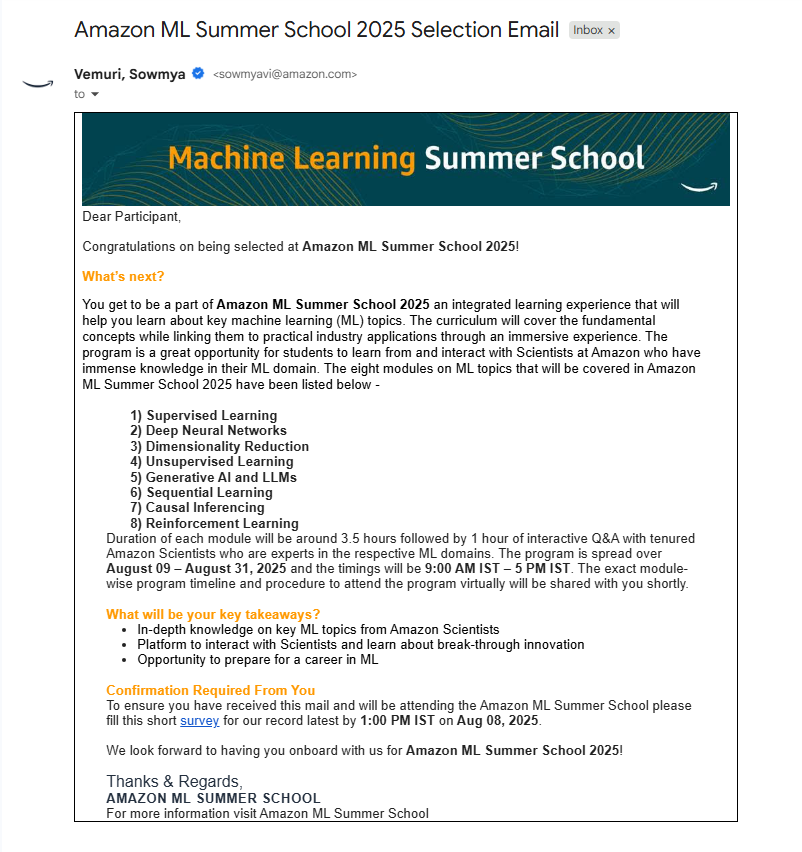

# Amazon ML Summer School 2025

Proof of selection and participation in **Amazon ML Summer School 2025** — a highly competitive program with ~60,000+ applicants and ~3,000 selected (~5% acceptance rate).  

## Proof of Selection

## Program Overview
- **Modules Covered:** Supervised/Unsupervised Learning, Deep Neural Networks, Generative AI, Reinforcement Learning, Causal Inference
- **Duration:** August–September 2025
- **Instructors:** Amazon Scientists
